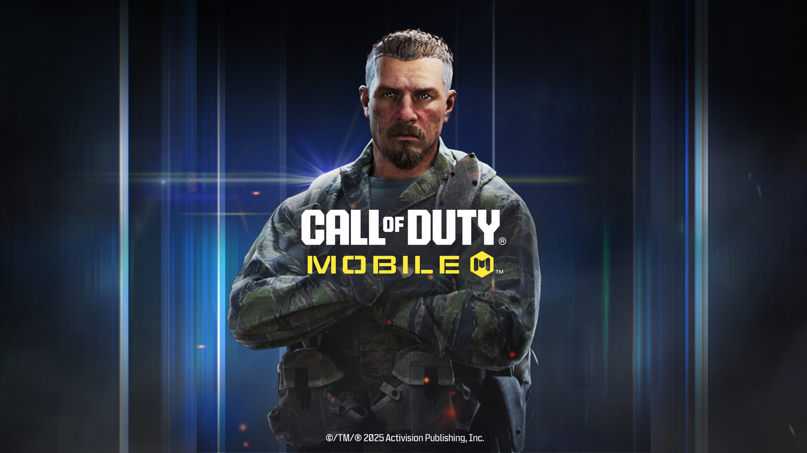

Henry COD Gaming Community Landing Page
======================================

A modern, responsive, animated single-page landing site for the Henry COD Gaming Community, built with React 18, Vite 6, Tailwind CSS, and GSAP.

Tech Stack
----------

- React 18
- Vite 6
- Tailwind CSS
- GSAP (+ @gsap/react)
- react-icons, react-use

Features
--------

- Cinematic hero with motion effects
- About and story-driven sections highlighting community identity
- Feature highlights with responsive grid and iconography
- Modular components (`Navbar`, `Hero`, `About`, `Features`, `Story`, `Footer`)
- Utility-first styling with Tailwind CSS
- Optimized static assets (images, audio, video) under `public/`

Project Structure
-----------------

```
.
├── index.html
├── public/
│   ├── img/ (brand and UI images)
│   ├── videos/ (feature/hero clips)
│   └── audio/ (sfx)
├── src/
│   ├── components/
│   │   ├── Navbar.jsx
│   │   ├── Hero.jsx
│   │   ├── About.jsx
│   │   ├── Features.jsx
│   │   ├── Story.jsx
│   │   ├── Footer.jsx
│   │   ├── Button.jsx
│   │   ├── AnimatedTitle.jsx
│   │   └── VideoPreview.jsx
│   ├── App.jsx
│   ├── index.css
│   └── main.jsx
├── tailwind.config.js
├── vite.config.js
└── package.json
```

Getting Started
---------------

Prerequisites: Node.js 18+ and npm.

Install dependencies:

```bash
npm install
```

Run in development:

```bash
npm run dev
```

Build for production:

```bash
npm run build
```

Preview production build:

```bash
npm run preview
```

Screenshots
-----------

Hero section:


Features section:



About section:


